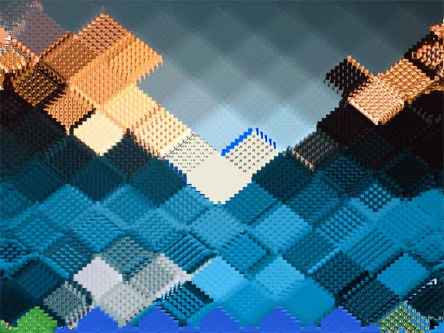



## Desktop Cubes

### Description

This is a slight variation from the "Raindrop Desktop" program that i submitted the other day.It creates a pattern on your desktop.

Update! Solved a timer issue with Win9x machines
 
### More Info
 

             |
---                |---
**Submitted On**   |2001-12-06 21:37:18
**By**             |[Asim Aziz](https://github.com/Planet-Source-Code/PSCIndex/blob/master/ByAuthor/asim-aziz.md)
**Level**          |Beginner
**User Rating**    |4.3 (13 globes from 3 users)
**Compatibility**  |VB 6\.0
**Category**       |[Graphics](https://github.com/Planet-Source-Code/PSCIndex/blob/master/ByCategory/graphics__1-46.md)
**World**          |[Visual Basic](https://github.com/Planet-Source-Code/PSCIndex/blob/master/ByWorld/visual-basic.md)
**Archive File**   |[Desktop\_Cu398211262001\.zip](https://github.com/Planet-Source-Code/asim-aziz-desktop-cubes__1-29485/archive/master.zip)

